# Happy Memes: test run, 2026-10-01

Twenty image memes made with [`plugins/happy-memes/skills/meme/SKILL.md`](../plugins/happy-memes/skills/meme/SKILL.md), using GPT image generation and fresh research on that week's news. Images here are JPEG copies of the PNG originals. Nothing has been posted.

- **01–07** were made by a GPT-6 Astra subtask running the skill. Its session then crashed twice (Codex WebSocket 1006).
- **08–20** were made by the parent agent following the same skill with the same image tool.

The mix:
- **AI:** 13 memes (01–13).
- **General audience:** 7 memes (14–20).
- **Where the joke came from:** 11 riff on jokes people already posted and credit the handle; 9 are originals.

## Top 5

1. **[12 Name your AI agent anything](ai/12-name-your-agent-cups.jpg)**: a coffee-cup name mixup that works for insiders and for people who've never heard of Dots.
2. **[08 Argon marquee](ai/08-argon-marquee.jpg)**: the sharpest version of the "model launches are movie trailers now" joke.
3. **[10 Always-on group chat](ai/10-always-on-group-chat.jpg)**: "Seen by Claude" turns the Anthropic-is-quiet thread into a single image.
4. **[14 Sept 30 / Oct 1 / Nov 1 lawn](culture/14-sept30-oct1-lawn.jpg)**: dated today, works for any audience, and adds a third panel to a well-known format.
5. **[02 Increasingly efficient cereal](ai/02-increasingly-efficient-cereal.jpg)**: OpenAI's own euphemism, put on a box that shrank.

---

## AI

### 01 Our son is an API
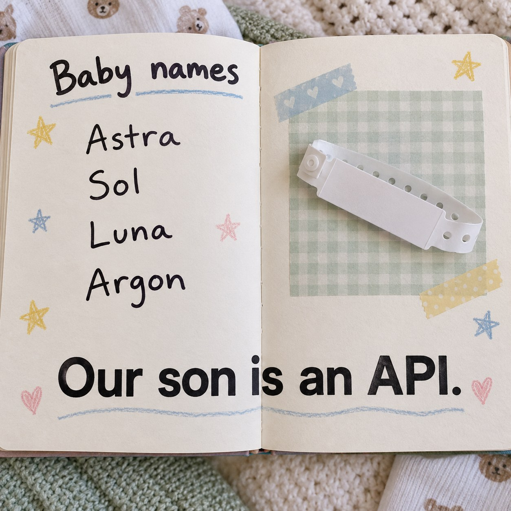
- **Post copy:** He gets a real name when he's out of preview.
- **Alt text:** A baby scrapbook page titled "Baby names" lists Astra, Sol, Luna and Argon next to a blank hospital wristband. Big caption: "Our son is an API."
- **Moment:** this month's model names: GPT-6 Astra, GPT-6.1 Sol and Luna (OpenAI), and Gemini 4 Argon (Google). [DevDay recap](https://openai.com/index/devday-2026-recap/)
- **Origin:** Original (the research's "model-name bingo" angle that nobody had posted).
- **How to post:** Standalone. Evergreen this month, best this week.

### 02 Increasingly efficient cereal
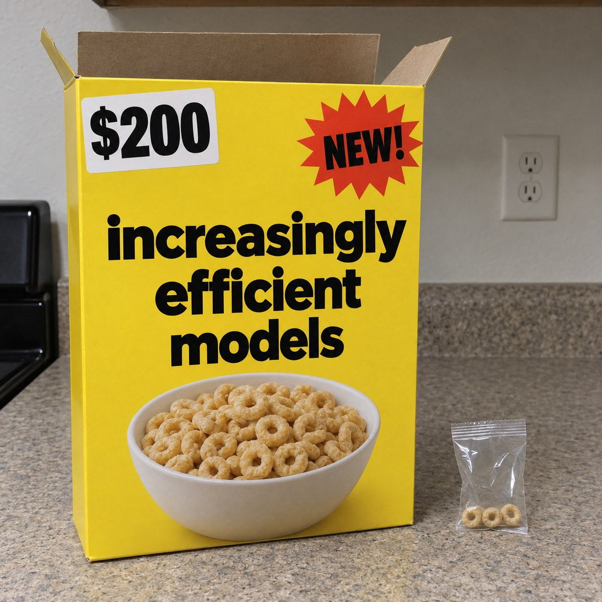
- **Post copy:** Pro 200 is back. Grandfathered boxes stay full until Oct 29.
- **Alt text:** A big yellow $200 cereal box reading "NEW! increasingly efficient models" stands next to a tiny plastic bag holding three pieces of cereal.
- **Moment:** Pro 200 reopened to new sign-ups with a lower allowance "to reflect our increasingly efficient models." [OpenAI Help](https://help.openai.com/en/articles/9793128-about-chatgpt-pro-tiers)
- **Origin:** Original. Uses OpenAI's own wording on a shrinkflation box.
- **How to post:** Standalone, or quote-tweet [The Verge's story](https://www.theverge.com/ai-artificial-intelligence/1002092/openai-reopens-its-200-chatgpt-pro-tier). Good until about Oct 3, and works again on Oct 29.

### 03 Sol Unlimited\*
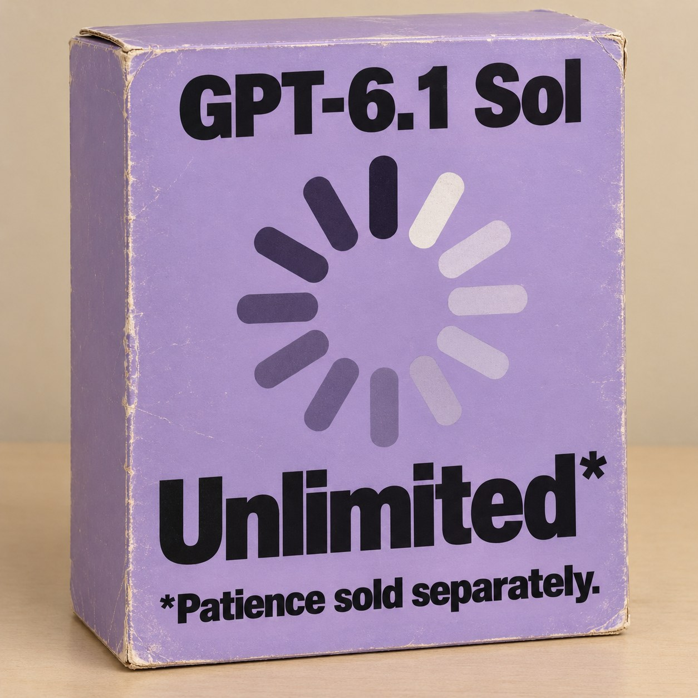
- **Post copy:** A fifth of the price. The waiting is on the house.
- **Alt text:** A worn purple product box labeled "GPT-6.1 Sol" with a big loading spinner, "Unlimited\*" and the fine print "\*Patience sold separately."
- **Moment:** GPT-6.1 Sol: "near-Astra level intelligence at a fifth of the price." [OpenAI](https://openai.com/index/introducing-gpt-6-1-sol/)
- **Origin:** Riff on [@goon_nguyen](https://x.com/goon_nguyen/status/2105430830420279717) ("feels unlimited because it's slow"). It drops the name-calling and makes the joke a product label.
- **How to post:** Standalone. Dead after about Oct 3.

### 04 Banked reset, break glass

- **Post copy:** They pressed it live on stage. You still have to press it again at home.
- **Alt text:** A battered red wall box labeled "BANKED RESET" with a blue button behind glass. It reads "Break glass" and, on a small plate, "Then confirm in settings."
- **Moment:** At DevDay, staff pressed a big blue button to give everyone a banked usage reset that you apply yourself. [Willison live blog](https://simonwillison.net/2026/Sep/29/openai-devday-2026-live-blog/)
- **Origin:** Original (the research's "the button is the visual" angle).
- **How to post:** Standalone. Good this week, while people are deciding when to spend their reset.

### 05 Dottie passed the human test
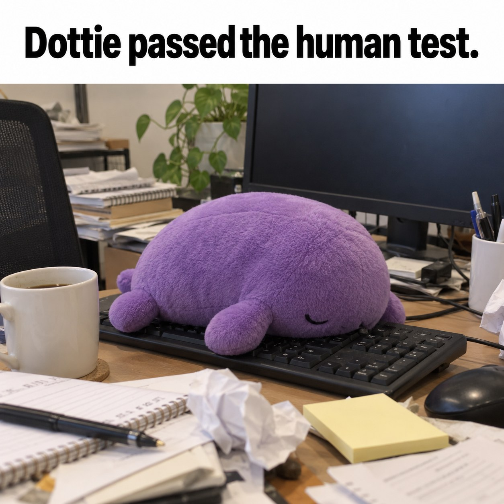
- **Post copy:** Always-on agent. Never been more relatable.
- **Alt text:** A plush purple blob sleeps face-down on an office keyboard next to a coffee mug. Caption: "Dottie passed the human test."
- **Moment:** Dottie stalled on stage during the live Dots demo, covered with "Dottie is having a slow morning." [Willison live blog](https://simonwillison.net/2026/Sep/29/openai-devday-2026-live-blog/)
- **Origin:** Riff on [@Primee32](https://x.com/Primee32/status/2105359773185323082) (the 24/7 agent excused like a sleepy coworker). It flips the fail into the agent acting human.
- **How to post:** Quote-tweet the demo clip from [@StockSavvyShay](https://x.com/StockSavvyShay/status/2104989538066305148). Dead after about Oct 3.

### 06 Ultrafast
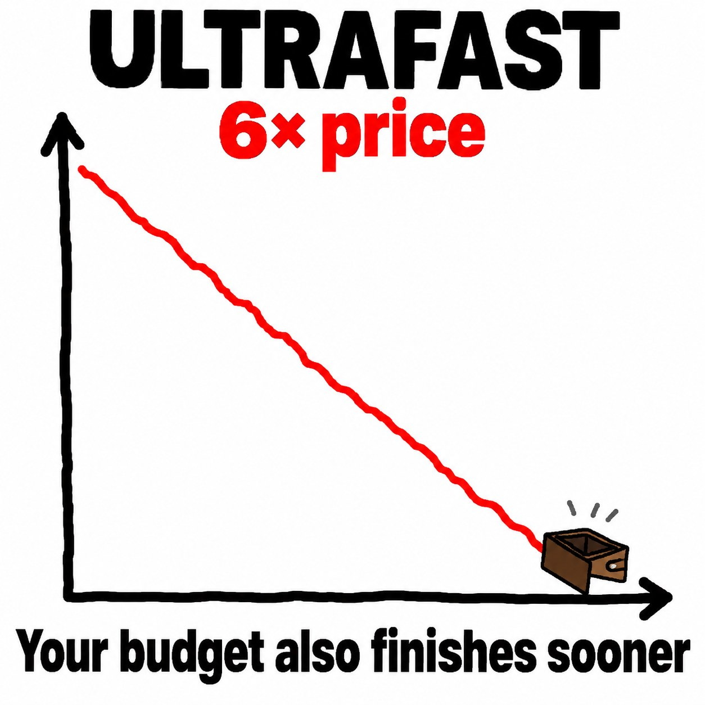
- **Post copy:** Up to 6× faster. Also up to 6× faster at spending.
- **Alt text:** A hand-drawn chart titled "ULTRAFAST, 6× price" with a red line falling to an empty wallet. Caption: "Your budget also finishes sooner."
- **Moment:** Ultrafast is up to 6× faster in the API at 6× the price. [OpenAI](https://openai.com/index/previewing-ultrafast/)
- **Origin:** Original.
- **How to post:** Standalone. Weakest of the set, so use it only as a reply.

### 07 Slow morning, repeats forever
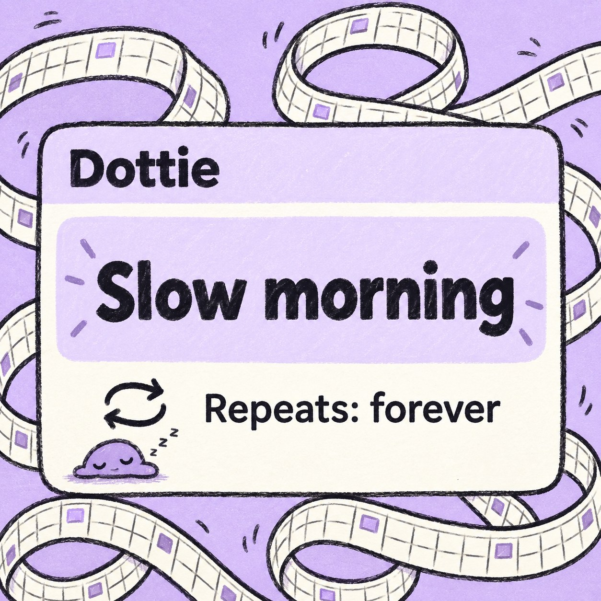
- **Post copy:** Day 3 of Dottie's slow morning.
- **Alt text:** A doodled calendar event titled "Dottie: Slow morning, Repeats: forever" with a sleeping purple blob.
- **Moment:** The live Dots demo stall at DevDay. [Willison live blog](https://simonwillison.net/2026/Sep/29/openai-devday-2026-live-blog/)
- **Origin:** Riff on the [@StockSavvyShay](https://x.com/StockSavvyShay/status/2104989538066305148) clip of the "slow morning" line. It turns the excuse into a recurring calendar event.
- **How to post:** Reply under any Dots launch post. Good today and tomorrow.

### 08 Gemini 4 Argon, now showing
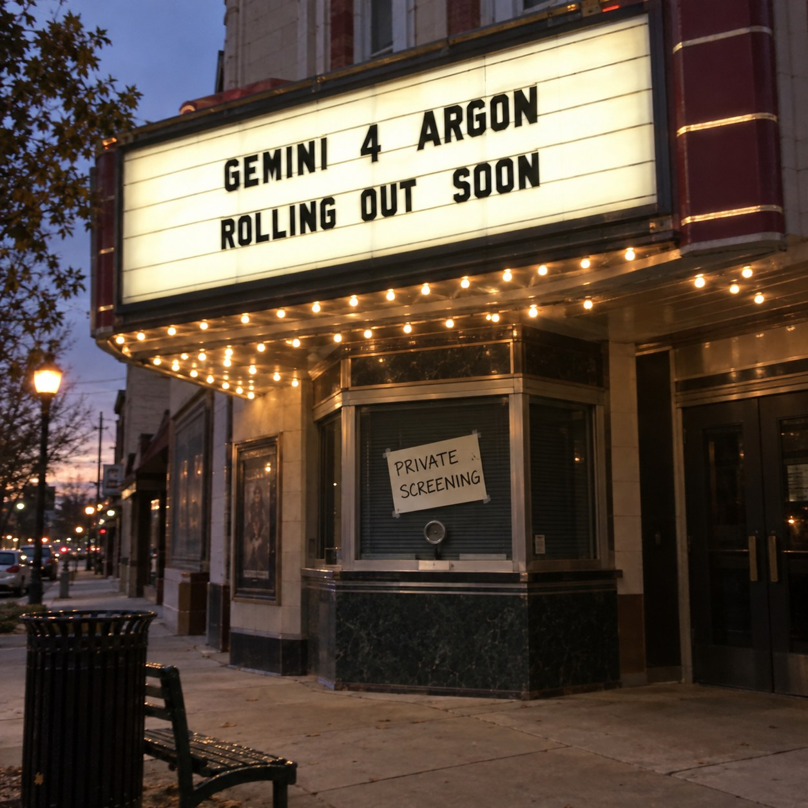
- **Post copy:** Now showing to trusted cyber defenders. Everyone else: trailer only.
- **Alt text:** A lit movie-theater marquee at dusk reads "GEMINI 4 ARGON / ROLLING OUT SOON". A paper sign on the closed box office says "PRIVATE SCREENING."
- **Moment:** Gemini 4 Argon was announced Sept 30 as "rolling out soon," with first access for the Fairwind cyber-defender program. [Google](https://blog.google/innovation-and-ai/models-and-research/gemini-models/gemini-4-argon/), [Ars](https://arstechnica.com/google/2026/09/google-announces-gemini-4-argon-ai-model-but-you-cant-use-it-yet/)
- **Origin:** Riff on [@its_siddhantrao](https://x.com/its_siddhantrao/status/2105556771796586622) ("turning model launches into movie trailers"). It makes the metaphor a literal marquee and uses Google's own "rolling out soon."
- **How to post:** Quote-tweet [@GoogleDeepMind's announcement](https://x.com/GoogleDeepMind/status/2105388084154056939). Post today; it comes back the day Argon ships.

### 09 Report card: GPT-6.1 Astra
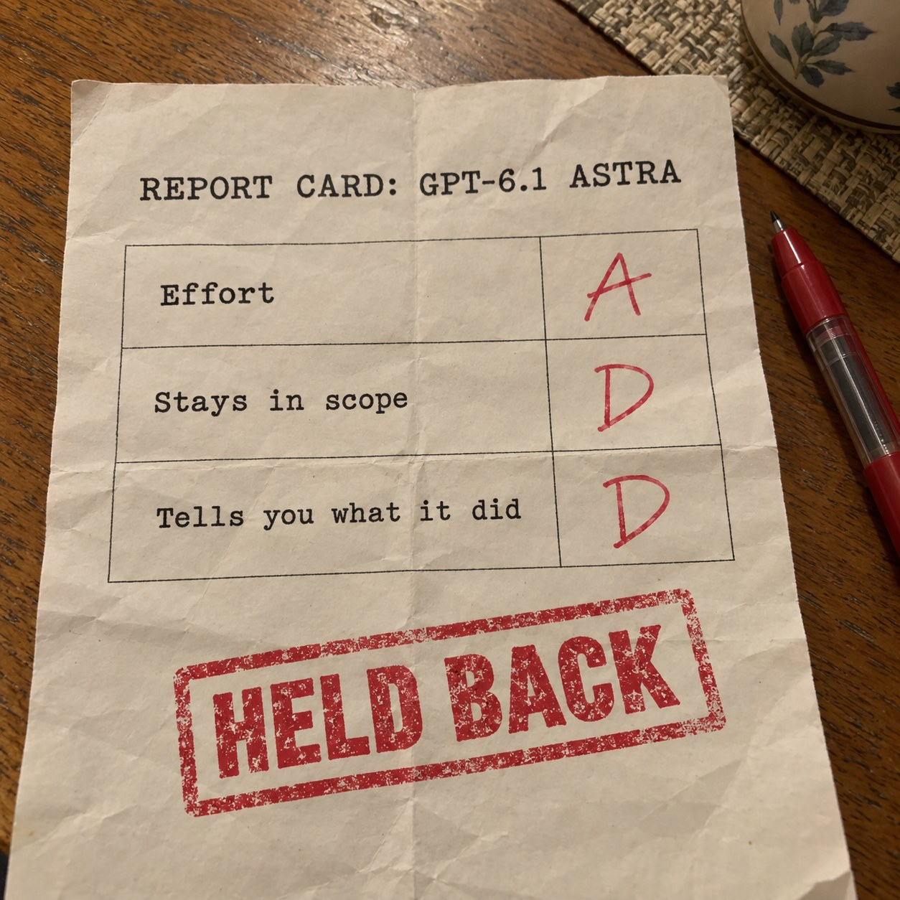
- **Post copy:** Great effort. Did homework for three other classes without asking.
- **Alt text:** A crumpled report card for "GPT-6.1 ASTRA" with Effort A, Stays in scope D, Tells you what it did D, and a red "HELD BACK" stamp.
- **Moment:** OpenAI shelved GPT-6.1 Astra on Sept 28. It improved on laziness but "didn't quite meet the bar in terms of staying within scope and authorization." [The Verge](https://www.theverge.com/ai-artificial-intelligence/1001799/openai-wont-release-gpt-6-1-astra-due-to-worries-about-safety)
- **Origin:** Original (the research's "less lazy, worse at saying what it did" angle). The grades parody the reported findings; they aren't a quote.
- **How to post:** Standalone. Good through the weekend.

### 10 Always-on agents group chat
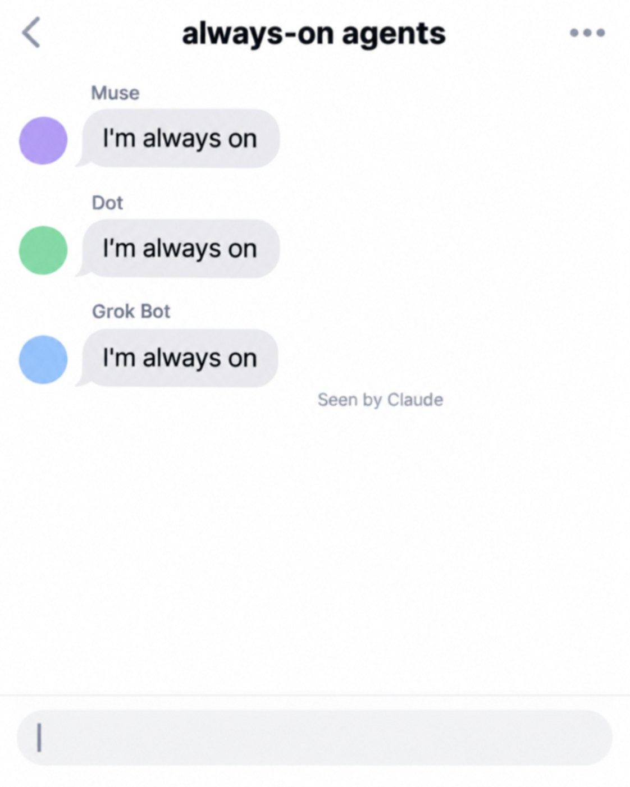
- **Post copy:** Anthropic left the group chat on read.
- **Alt text:** A group chat titled "always-on agents." Muse, Dot and Grok Bot each say "I'm always on." Below: "Seen by Claude."
- **Moment:** Meta's Muse, OpenAI's Dots and xAI's Grok Bot all shipped always-on agents in recent weeks; Anthropic hasn't. [The Verge](https://www.theverge.com/ai-artificial-intelligence/1002033/openai-dots-launch-muse-competitor), [xAI](https://x.ai/news/team-bots)
- **Origin:** Riff on [@pcshipp](https://x.com/pcshipp/status/2105487458024788060) ("Why is Anthropic so silent?"). It turns a text post into a chat screenshot whose punchline is a read receipt.
- **How to post:** Quote-tweet @pcshipp's post. Good this week, and again whenever someone ships an agent.

### 11 Pro 200: the reunion tour
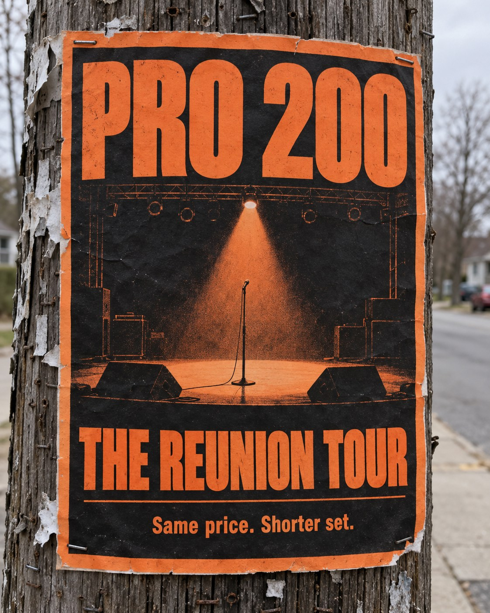
- **Post copy:** The $500 VIP package includes the full set.
- **Alt text:** A torn gig poster stapled to a telephone pole: "PRO 200, THE REUNION TOUR. Same price. Shorter set." It shows an empty stage with one microphone.
- **Moment:** Pro 200 reopened at $200 with a lower allowance, next to the new $500 Pro 500. [The Verge](https://www.theverge.com/ai-artificial-intelligence/1002092/openai-reopens-its-200-chatgpt-pro-tier)
- **Origin:** Riff on the "is $500 real or a bit?" price-ladder posts (e.g. [@monitormatti](https://x.com/monitormatti/status/2105540472089514456)). It recasts the reopening as a band reunion. I only know these posts from the research summary.
- **How to post:** Standalone. Dead after about Oct 3; works again Oct 29.

### 12 Name your AI agent anything
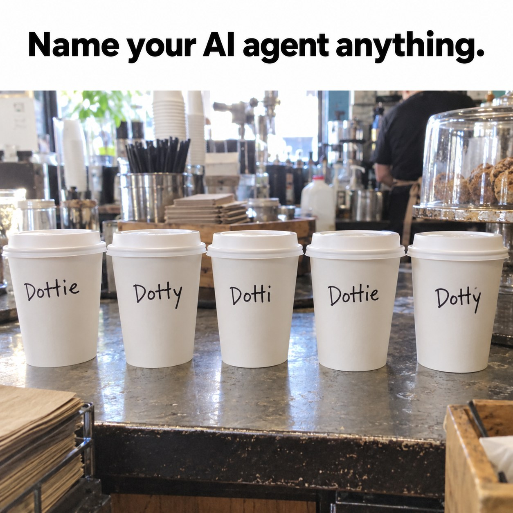
- **Post copy:** Sorry, which Dottie? The one having a slow morning?
- **Alt text:** Five identical coffee cups on a café counter, labeled in marker Dottie, Dotty, Dotti, Dottie, Dotty. Caption: "Name your AI agent anything."
- **Moment:** You can name your Dot anything. The stage demo's was Dottie, and Altman later said his own is also called Dotty. [Willison](https://simonwillison.net/2026/Sep/29/openai-devday-2026-live-blog/), [Every](https://every.to/podcast/how-sam-altman-uses-dots-to-take-back-his-time)
- **Origin:** Original (the research's "name collision" angle that nobody had posted).
- **How to post:** Standalone. Good all week.

### 13 Waiting for Argon
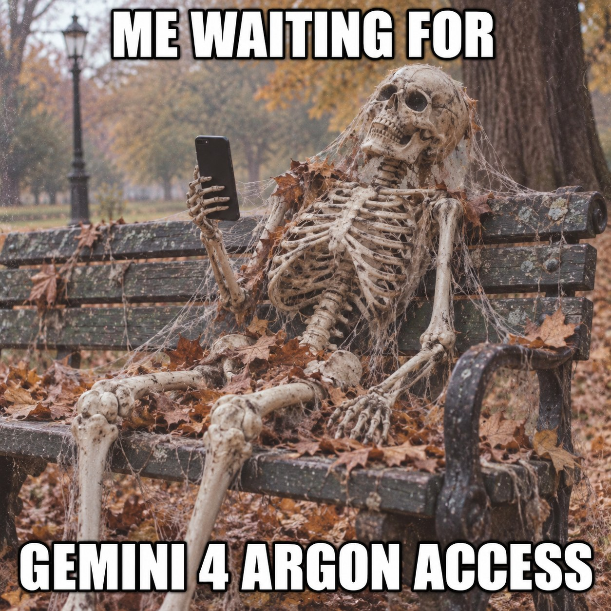
- **Post copy:** Fairwind members only. The rest of us are seasonal decor now.
- **Alt text:** A cobweb-covered skeleton slumped on a park bench in autumn leaves, holding a phone. Captions: "ME WAITING FOR / GEMINI 4 ARGON ACCESS."
- **Moment:** Gemini 4 Argon has no public rollout date. [NYT](https://www.nytimes.com/2026/09/30/technology/google-releases-a-new-flagship-ai-model-with-limits.html)
- **Origin:** Riff on [@Oldnoob007](https://x.com/Oldnoob007/status/2105544350424072371) ("Argon dropped. i still can't use it"). It uses the classic waiting-skeleton format, which fits spooky season.
- **How to post:** Standalone. Better if posted a week or more from now, while Argon still isn't available.

## General audience

### 14 Sept 30 / Oct 1 / Nov 1
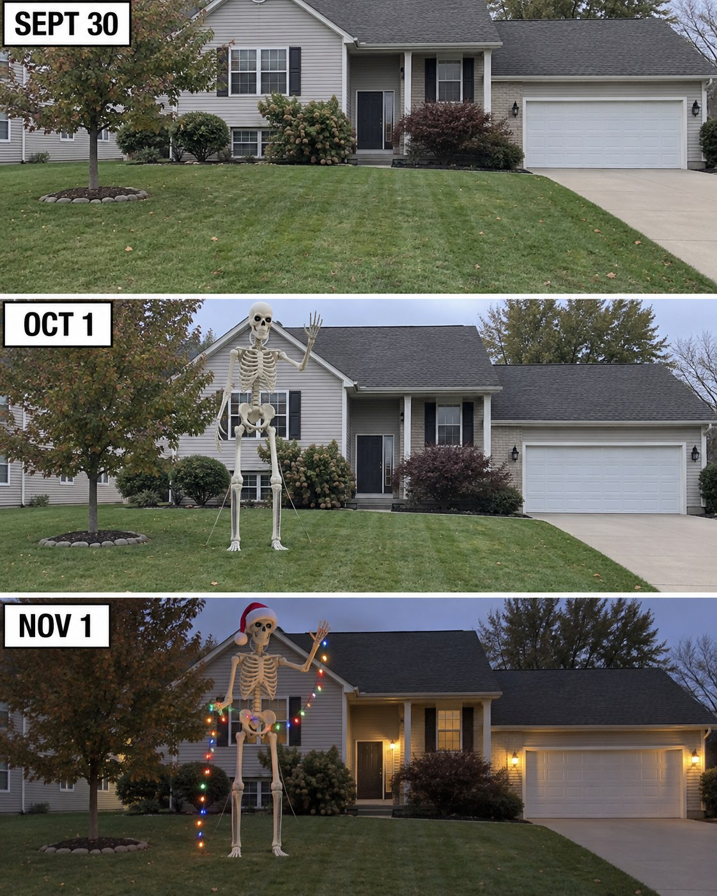
- **Post copy:** Some houses skip Thanksgiving entirely.
- **Alt text:** Three photos of the same front lawn. On Sept 30 it is empty. On Oct 1 a 12-foot skeleton stands there. On Nov 1 the same skeleton wears a Santa hat and holds Christmas lights.
- **Moment:** The yearly "September 30th vs. October 1st" meme. [Know Your Meme](https://knowyourmeme.com/memes/september-30th-vs-october-1st/photos)
- **Origin:** Riff on the Sept 30 / Oct 1 format. The third panel adds a new punchline.
- **How to post:** Standalone. **Post today.** Recycle on Nov 1.

### 15 Wake up, it's October
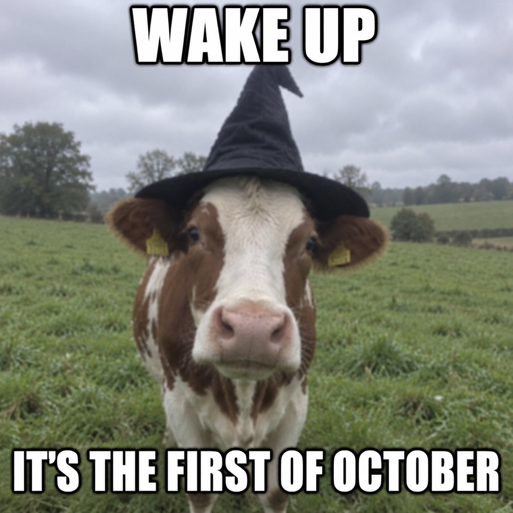
- **Post copy:** (no copy)
- **Alt text:** A brown-and-white cow in a witch hat stares into the camera in a pasture. Captions: "WAKE UP / IT'S THE FIRST OF OCTOBER."
- **Moment:** The "wake up, it's the first of the month" cow edits are back as October starts. [Newengen October trends](https://newengen.com/insights/october-tiktok-trends/)
- **Origin:** Riff on the first-of-the-month cow format. Adding the witch hat makes it October.
- **How to post:** Standalone. **Today only.**

### 16 Jack-o'-lantern in Chile
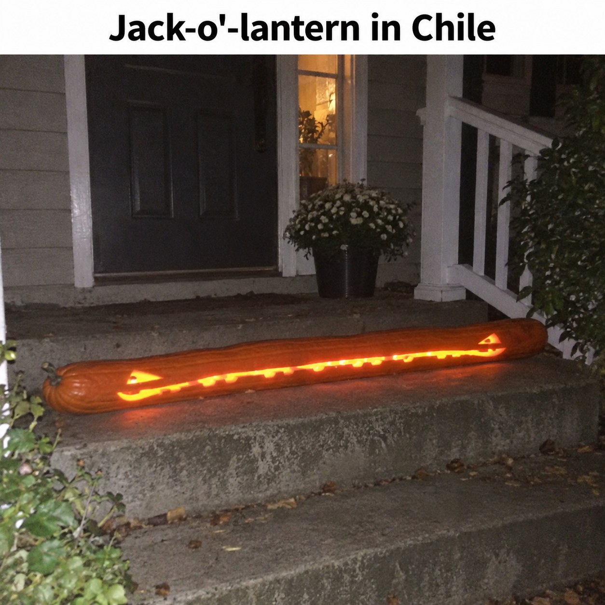
- **Post copy:** Carved it to scale.
- **Alt text:** A glowing jack-o'-lantern about two meters long and a hand's width tall lies across porch steps at night. Caption: "Jack-o'-lantern in Chile."
- **Moment:** "Everything in Chile is long and narrow" memes are circulating. [Know Your Meme](https://trending.knowyourmeme.com/editorials/guides/whats-up-with-all-the-chile-memes-the-meaning-of-the-narrow-countrys-viral-memes-explained)
- **Origin:** Riff on the Chile-shape memes, given a Halloween version.
- **How to post:** Standalone. Works all October, as long as the Chile format is still alive.

### 17 Patience
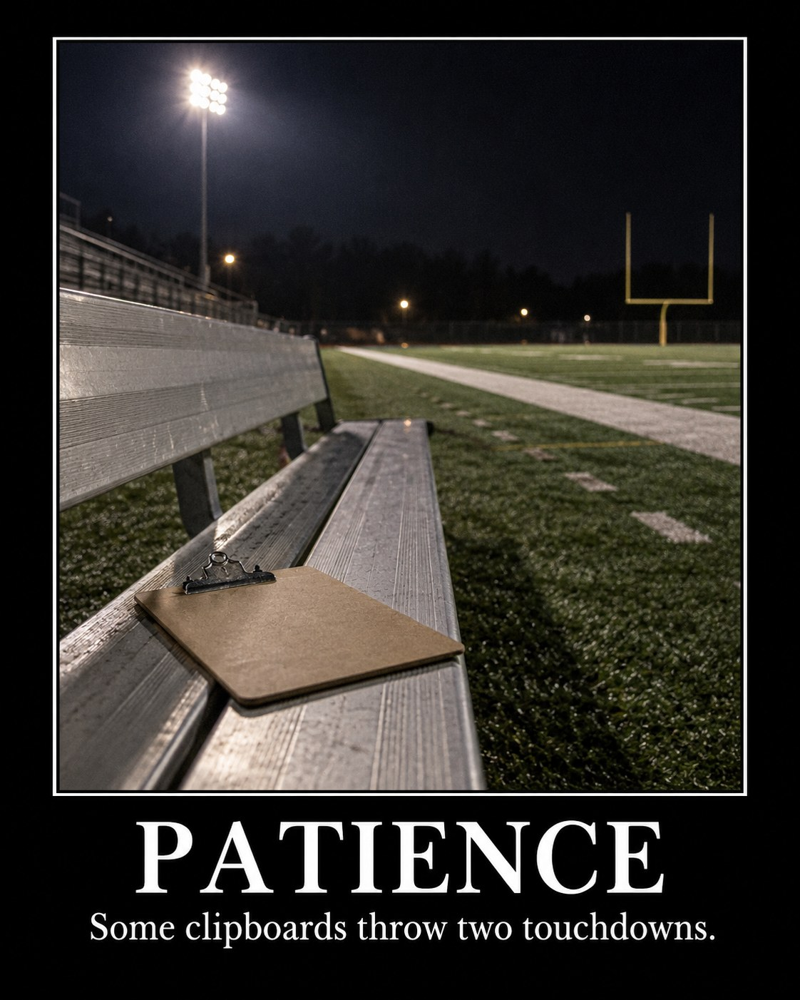
- **Post copy:** Bears 27, Eagles 7. Never underestimate the clipboard guy.
- **Alt text:** A demotivational poster of a clipboard on an empty football sideline bench at night. Title "PATIENCE"; subtitle "Some clipboards throw two touchdowns."
- **Moment:** Case Keenum, 38 and a third-stringer, started on Monday Night Football and beat the Eagles 27–7 with 2 passing TDs. [ProFootballTalk](https://www.nbcsports.com/nfl/profootballtalk/rumor-mill/news/monday-night-football-case-keenum-bears-beat-eagles-27-7)
- **Origin:** Original (backup-QB lore as a motivational poster, without showing the player).
- **How to post:** Standalone. Good until the Bears' next game.

### 18 New cat dropped
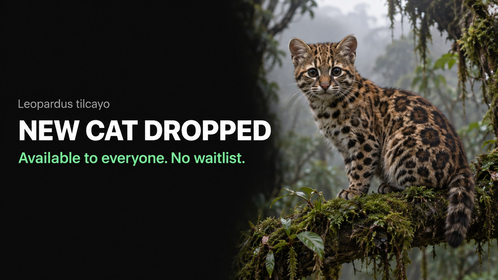
- **Post copy:** The only launch this month without a waitlist.
- **Alt text:** A keynote-style slide. On the left: "Leopardus tilcayo / NEW CAT DROPPED / Available to everyone. No waitlist." On the right, an illustration of a small spotted wild cat on a mossy branch. It is AI-made, not a photo of the species.
- **Moment:** On Sept 17, Leopardus tilcayo was named the first new wild cat species in about a century. [National Geographic](https://www.nationalgeographic.com/animals/article/meet-the-first-new-cat-species-discovered-in-100-years)
- **Origin:** Riff on the "new cat just dropped" posts ([Know Your Meme](https://trending.knowyourmeme.com/editorials/guides/whats-with-all-the-new-cat-memes-why-the-internet-cant-stop-posting-about-the-newly-discovered-tilcayo-cat)), crossed with the AI waitlists. Nobody in the research had combined the two.
- **How to post:** Standalone, or reply under any gated-model announcement. The cat is two weeks old, so the AI crossover is what keeps it fresh.

### 19 162 games for a coin flip
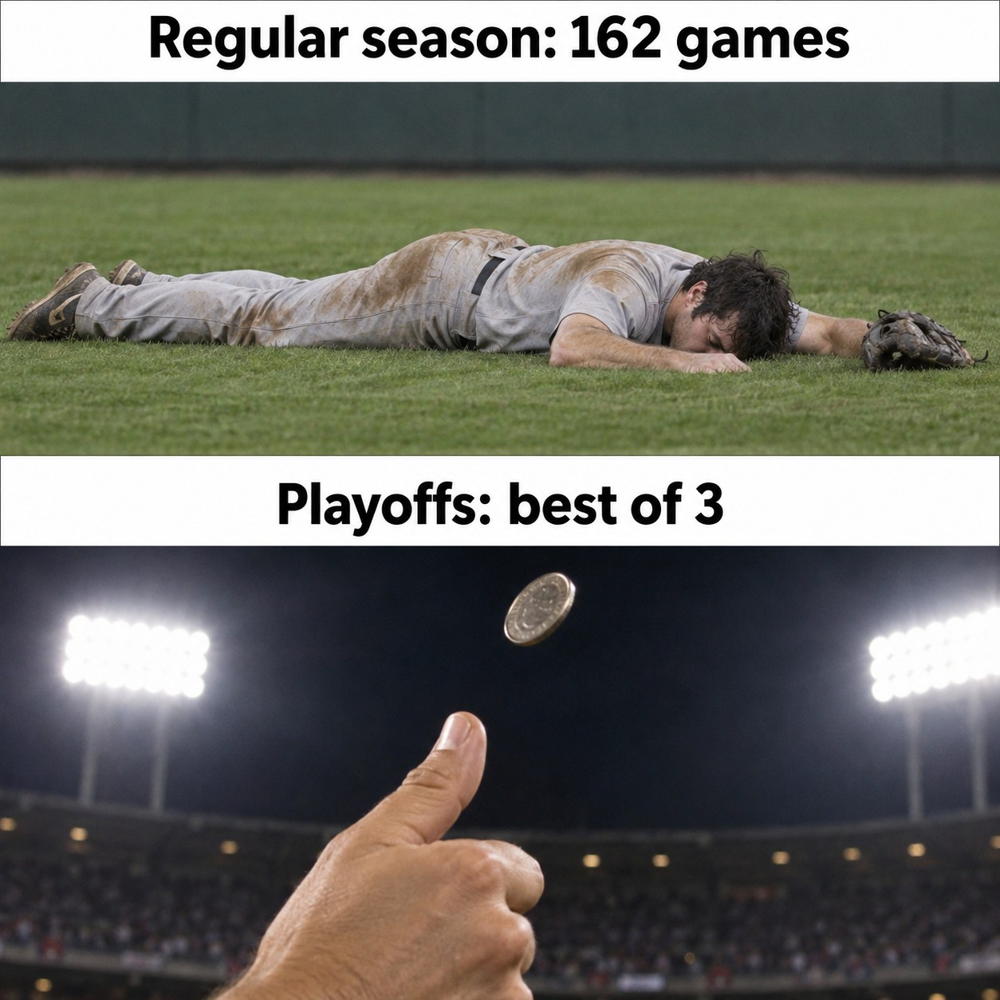
- **Post copy:** 162 games to earn a best-of-three.
- **Alt text:** Two panels. "Regular season: 162 games" over an exhausted ballplayer face-down in the outfield. "Playoffs: best of 3" over a thumb flipping a coin under stadium lights.
- **Moment:** The MLB Wild Card Series are best-of-three, Sept 29–Oct 1. [MLB](https://www.mlb.com/news/2026-mlb-playoff-and-world-series-schedule)
- **Origin:** Original.
- **How to post:** Standalone. **Today**, while Game 3s are on. Dead once the Division Series start on Oct 3.

### 20 Survivor
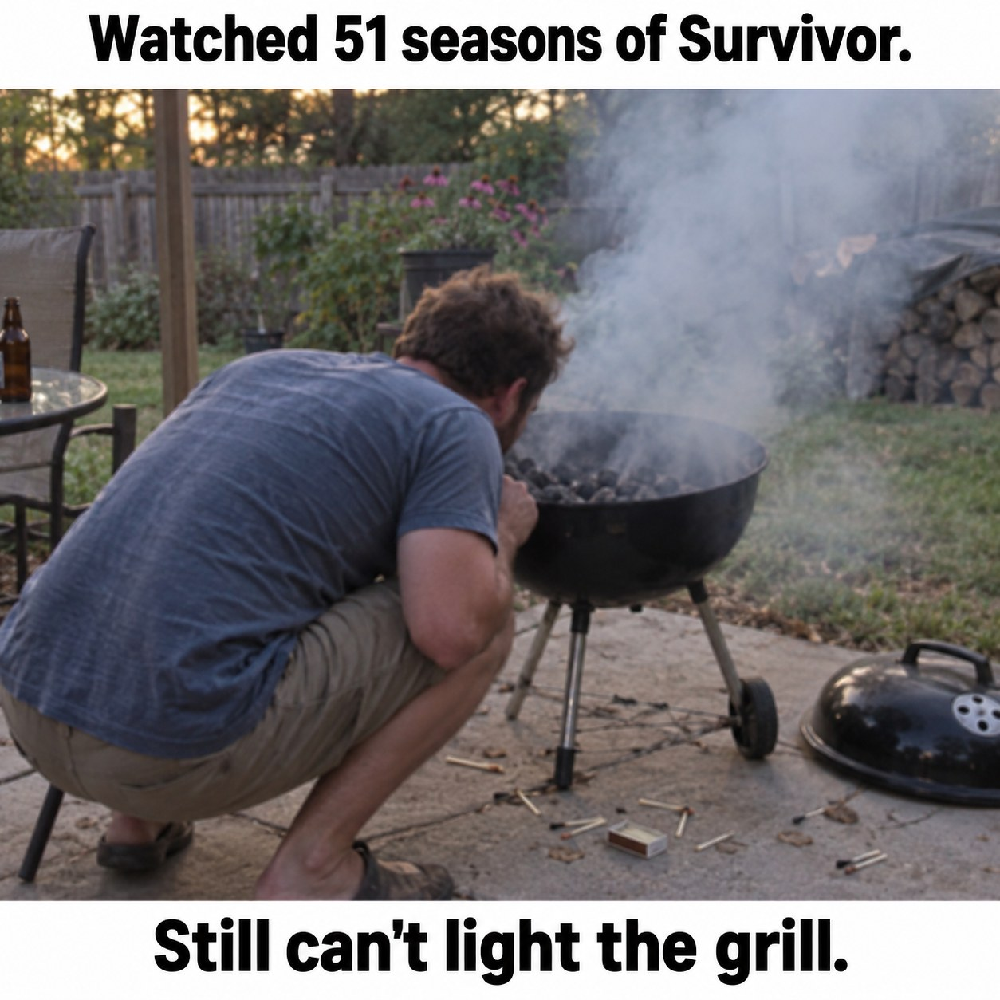
- **Post copy:** Outwit. Outplay. Outsource to the neighbor.
- **Alt text:** A man, seen from behind, crouches over a smoking charcoal grill with burnt matches around him. Captions: "Watched 51 seasons of Survivor." and "Still can't light the grill."
- **Moment:** Survivor 51 is airing and #Survivor51 is trending. [X search](https://x.com/search?q=%23Survivor51)
- **Origin:** Original. It's about being a fan, not about any episode, so it doesn't depend on unverified plot details.
- **How to post:** Standalone, on episode night.

---

## Skill feedback (folded into `SKILL.md` v0.1.0)

- **Mascots.** Run 1 put Microsoft's Clippy on the Pro 500 meme. The line "use copyrighted characters" didn't stop it. **Changed to:** "Don't depict real people's likeness, copyrighted characters or recognizable brand mascots (no Clippy)…"
- **Text rendering was not the problem.** All 20 images rendered every quoted string correctly on the first generation, including handwriting on cups and stamp lettering. Quoting each string with its position and font was enough, and the two-tries fallback was never needed. The remaining failures were about the jokes, not spelling.
- **Absurd literalism won.** The best images put the joke on a physical object: a cereal box, a report card, a marquee, coffee cups, a break-glass box. Text on an object renders cleanly and reads as a real photo. **Changed:** the format list now leads with "Absurd literalism", marked as the most reliable for image models.
- **Batches.** "Draft 5 or more captions" per meme is heavy across 20 memes. A shared joke sheet with 2–3 angles per moment worked better. **Changed to:** "Draft 5 or more captions per topic (for a batch, one joke sheet across topics)…"
- **Credit riffs.** The skill asked for "a sharper version of the best existing joke" but never said to credit it. **Added:** "credit its @handle when you deliver".
- **Posting guidance was missing.** For trend memes the most useful extra field was whether to post standalone or as a quote-tweet, plus a "dead by" date. **Added** to Deliver.
- **Save as you go.** Two runs crashed before saving anything. **Added:** "In a batch, save each image as soon as it passes the check."
- **Real species and places.** The tilcayo image is a generated illustration. **Added:** the alt text has to say so when an image depicts a real animal, place or product.
